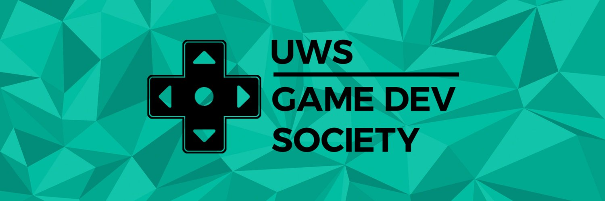

# hacktober-game

  
  This is the repository hosting the UWS <a href="https://hacktoberfest.digitalocean.com/" target="_blank">Hacktoberfest 2021</a> Collaborative Game Project.

The project contains some asset packages and tools to help you get started quicker. It also contains Unity's **Creator Kit: Beginner Code** package, which provides a framework that helps beginners get creating, coding, and designing! If you want, you can dive right in and create your first [Pull Request](./compare), or follow along with the [Tutorial](https://learn.unity.com/tutorial/get-started-with-creator-kit-beginner-code) provided! Whether you're a beginner or an expert, You should check out the documentation for the framework, which you can find [here](https://uws-gamedev-society.github.io/hacktober-game/).

With the [Games Development Society](https://www.uwsunion.org.uk/society/uwsgamsedevsociety/) being an educational society and all, we do have some learning outcomes for this project. First and foremost, we want this to be a collaborative project where anyone can contribute and learn the ropes of game development. By the end of the project, you'll have hopefully learned some of the following.

#### Learning Outcomes

+ Learn the ropes of Game Development with the Unity Engine
+ Using GitHub to contribute to an [open-source](https://en.wikipedia.org/wiki/Open_source) project
+ Communicate and coordinate with others to come up with ideas and foster those ideas into actual gameplay elements

## Getting started

First, you should gloss over the [Project Details](#project-details). There, you'll find a summary of the type of game we have decided we want to create with everyone this year. Once you've read and memorised all of that, head over to the [Contributing](#contributing) section, where you'll learn more about how to actually get started.

# Project Details

  
<b>Project Details</b>

## Genre
The genre defines the overarching "type" of game that we want to create. This year's genre is:

### • Puzzle

## Setting
The setting tells the player the overall style of the game in terms of time period, architecture, and environment. This year's setting is:

### • Utopia

## Theme
The theme is the main characteristic or definition of the game. Not everything in the game needs to be considered with the theme in mind. However, the more things are, the more consistent the game will be! This year's theme is:

### • Pursuit

## Creative Rule
This rule is a creative limitation to make the game a bit more interesting. Not everything in the game needs to be made to follow this rule, but the main gameplay elements should be considered with this rule in mind. This year's creative rule is:

### • Don't Stop Moving
  

# Tools you'll need

  
<b>Tools you'll need</b>

  

# Contributing

  
<b>Contributing</b>

  
We'll be making heavy use of the open-source workflow, which should really help instill good practice when it comes to project management and contributing to projects. Some of the terminology may be unfamiliar to you, so following are some refreshers. You can also always just look up a term in the [GitHub Glossary](https://docs.github.com/en/get-started/quickstart/github-glossary) or [Google](https://google.com) 😋
  

  
<b>Quick Glossary Refresher</b>

+ Git
  + Git is an open source program for tracking changes in text files. It was written by the author of the Linux operating system, and is the core technology that GitHub, the social and user interface, is built on top of.
+ Project
  + The **Unity** Project, which is generally accessed through the [Unity Hub](https://docs.unity3d.com/Manual/GettingStartedInstallingHub.html).
+ Repository
  + A repository is the most basic element of GitHub. They're easiest to imagine as a project's folder. A repository contains all of the project files (including documentation), and stores each file's revision history. Repositories can have multiple collaborators and can be either public or private.
+ Remote
  + This is the version of a repository or branch that is hosted on a server, most likely GitHub.com. Remote versions can be connected to local clones so that changes can be synced. If you're reading this in a browser, your remote is most likely the URL of this page!
+ Issue
  + Issues are suggested improvements, tasks or questions related to the repository. Issues can be created by anyone (for public repositories), and are moderated by repository collaborators. Each issue contains its own discussion thread. You can also categorize an issue with labels and assign it to someone.
+ Commit
  + A commit, or "revision", is an individual change to a file (or set of files). When you make a commit to save your work, Git creates a unique ID (a.k.a. the "SHA" or "hash") that allows you to keep record of the specific changes committed along with who made them and when. Commits usually contain a commit message which is a brief description of what changes were made.
+ Pushing/Pulling
  + To Push means to send your committed changes to a remote repository on GitHub.com. For instance, if you change something locally, you can push those changes so that others may access them.
  + A Pull refers to when you are fetching in changes and merging them. For instance, if someone has edited the remote file you're both working on, you'll want to pull in those changes to your local copy so that it's up to date. See also fetch.
+ Pull Request
  + Pull requests are proposed changes to a repository submitted by a user and accepted or rejected by a repository's collaborators. Like issues, pull requests each have their own discussion forum.
  + [Learn more about PRs](https://docs.github.com/en/github/collaborating-with-pull-requests/proposing-changes-to-your-work-with-pull-requests/about-pull-requests)

## How do I get started?

1. Fork & Clone this repository to your local machine. You only have to do this once. ([how?](https://docs.github.com/en/desktop/contributing-and-collaborating-using-github-desktop/adding-and-cloning-repositories/cloning-and-forking-repositories-from-github-desktop#forking-a-repository))
3. Create a new branch, loosely named after the feature you'd like to add ([how?](https://docs.github.com/en/desktop/contributing-and-collaborating-using-github-desktop/making-changes-in-a-branch/managing-branches#creating-a-branch))
4. Open the project in Unity ([how?](https://docs.unity3d.com/2019.1/Documentation/Manual/GettingStarted.html))

From here, you have 2 choices:

+ [Review](https://github.com/UWS-Gamedev-Society/hacktober-game/projects/1) any outstanding tasks, pick one, and let others know that you'd like to tackle it by commenting on the issue. If you're not sure how to go about tackling it, ask for help!
  + Alternatively, You can totally also [throw your own ideas into the mix](https://github.com/UWS-Gamedev-Society/hacktober-game/issues/new)!
+ Work away at anything you'd like to see in the game!

Once you're done creating and are satisfied with what you've worked on, make sure you:

1. Commit & Push your changes ([how?](https://docs.github.com/en/desktop/contributing-and-collaborating-using-github-desktop/making-changes-in-a-branch/committing-and-reviewing-changes-to-your-project#write-a-commit-message-and-push-your-changes))
2. Create a Pull Request ([how?](https://docs.github.com/en/desktop/contributing-and-collaborating-using-github-desktop/working-with-your-remote-repository-on-github-or-github-enterprise/creating-an-issue-or-pull-request#creating-a-pull-request))
3. Wait for a project maintainer to review your PR (how boring!)

You can delete your feature branch once your PR has been accepted!

#### Important things to remember

+ Make sure to create a new branch for every feature you intend to add. This makes it easier to merge your hard work into the main repository and allows you to submit multiple features simultaneously.
  

